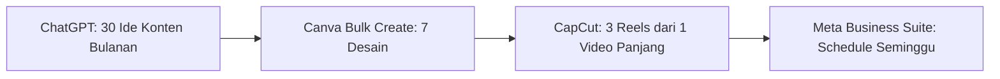

# Studi Kasus: Warung Makan 'Bu Siti' Naik 3x Omzet Pakai AI (6 Bulan)

> **Latar belakang:** Warung makan "Bu Siti" di Depok, Jawa Barat. Menu: Nasi Goreng, Mie Goreng, Ayam Goreng, Sop. Sebelum pakai AI: omzet Rp 15-18 juta/bulan, marketing cuma mulut ke mulut.

---

## Timeline Perjalanan

| Bulan | Fokus | Tools | Hasil |
|-------|-------|-------|-------|
| **1** | Audit + Setup Dasar | ChatGPT, Canva, Google Business | Profil Google Maps lengkap, 50 review |
| **2** | Konten Sosmed Rutin | ChatGPT, CapCut, Meta Business Suite | 1.000 follower IG, 500 WA broadcast |
| **3** | Otomasi Order | Make, Fonnte, Google Sheets | Waktu proses order: 10 menit → 1 menit |
| **4** | Iklan Tertarget | Meta Ads, ChatGPT (copy), Canva | ROAS 4.2x, CAC Rp 8.000 |
| **5** | Loyalitas & Upsell | Notion, Fonnte Broadcast | Repeat order 40%, AOV naik 25% |
| **6** | Skala & Sistem | Semua tools terintegrasi | **Omzet Rp 45 juta/bulan** |

---

## Detail Setiap Tahap

### Bulan 1: Fondasi Digital (Biaya: Rp 0)

**Masalah:** Nggak punya Google Maps, nggak punya IG, nggak punya sistem.

**Aksi:**
1. **Daftar Google Business Profile** — Lengkapi: jam buka, menu + harga, foto makanan (hp aja), alamat lengkap
2. **Minta Review** — Print QR code Google Review, taruh di meja + struk. Insentif: "Review + foto = gratis es teh"
3. **Buat Instagram Bisnis** — Username: `@busiti.depok`, bio jelas + link WA order
4. **Content Pilar 4** (ChatGPT generate 30 ide):
   - **Produk:** Close-up makanan, BTS masak
   - **Edukasi:** "Rahasia nasi goreng enak", "Tips pilih beras"
   - **Social Proof:** Repost story pelanggan, screenshot review
   - **Promo:** "Kamis Nasi Goreng 2+1", "Bundle hemat keluarga"

**Hasil Bulan 1:** 50 review Google (rating 4.8), 300 follower IG, 200 kontak WA broadcast.

---

### Bulan 2: Sistem Konten Otomatis (Biaya: Rp 150k/bln - Canva Pro)

**Masalah:** Buat konten manual capek, nggak konsisten.

**Solusi: Workflow 1 Jam = 7 Hari Konten**



**Prompt ChatGPT untuk Kalender Konten:**
```
Buatkan kalender konten Instagram 30 hari untuk warung makan "Bu Siti" di Depok.
Menu: Nasi Goreng, Mie Goreng, Ayam Goreng, Sop, Nasi Uduk.
Target: Ibu rumah tangga 25-45 th, karyawan sekitar kantor.
Format: Tabel | Tanggal | Tipe (Foto/Reels/Story) | Caption | Hashtag | CTA
Tone: Hangat, kekinian, pake bahasa sehari-hari (nggak kaku).
```

**Tools & Biaya:**
- **ChatGPT Plus** ($20/bln) — ide, caption, hashtag research
- **Canva Pro** (Rp 180k/bln) — template brand, bulk create, magic resize
- **CapCut Desktop** (Gratis) — auto caption, text-to-speech, template Reels
- **Meta Business Suite** (Gratis) — schedule, analytics, manage DM

**Hasil Bulan 2:** 1.000 follower IG, engagement rate 4.5%, 500 kontak WA broadcast aktif.

---

### Bulan 3: Otomasi Order WA → Sheets (Biaya: Rp 0)

**Masalah:** Bu Siti manual catat order di buku, kadang salah, lama, stres jam makan siang.

**Solusi: Make + Fonnte + Google Sheets (Gratis 1000 ops/bln)**

**Flow Otomatis:**
```
Pelanggan WA "Order Nasi Goreng x2" 
    → Webhook Make 
    → Parse: Produk "Nasi Goreng", Qty "2" 
    → Simpan ke Google Sheets (baris baru) 
    → Kirim WA ke Admin: "🔔 Order: Nasi Goreng x2 - Bu Siti" 
    → Balas ke Pelanggan: "Terima kasih! Diantar 11:30. Total Rp 25.000"
```

**Setup 15 Menit (Sudah dibahas di artikel: [Otomasi Order WA ke Google Sheets](/blog/ai-automation/otomasi-order-wa-google-sheets))**

**Hasil Bulan 3:**
- Waktu proses order: **10 menit → 1 menit**
- Error order: **5% → 0%**
- Bu Siti bisa fokus masak, nggak stres catat manual
- Data order tersimpan rapi → bisa analisis menu laris

---

### Bulan 4: Iklan Meta Ads Tertarget (Biaya: Rp 2jt test → Rp 5jt/bln)

**Masalah:** Organik lambat, butuh pelanggan baru konstan.

**Strategi Iklan Murah Meriah:**

| Kampanye | Target | Format | Budget Harian | KPI |
|----------|--------|--------|---------------|-----|
| **Awareness** | Radius 5km, Umur 25-45, Minat: Kuliner, Makanan Indonesia | Reels 15 detik (BTS masak + close-up makanan) | Rp 50k | Jangkauan, Video View |
| **Traffic** | Lookalike 1% dari pengunjung web/WA | Carousel: Menu Bestseller + Harga + Promo | Rp 100k | Link Click, CPC < Rp 500 |
| **Conversion** | Retargeting: Video viewer 3 detik + WA broadcast | Single Image: "Order Sekarang - Gratis Ongkir 5km" | Rp 150k | WA Chat, ROAS > 3x |

**Copy Iklan (ChatGPT Generate):**
```
Tulis 3 variasi copy iklan Meta Ads untuk warung makan "Bu Siti":
USP: Bumbu buatan sendiri, porsi melimpah, harga ramah kantong mahasiswa/karyawan.
Format: Hook + Benefit + Social Proof + CTA + Urgency.
Bahasa: Casual, pakai "gue/loe" ringan, emoji secukupnya.
Panjang: Primary text 125 karakter, Headline 40 karakter.
```

**Hasil Bulan 4 (1 bulan test):**
- Total spend: Rp 2.000.000
- Order dari iklan: 85 order
- Revenue iklan: Rp 8.500.000
- **ROAS: 4.25x**
- CAC (Cost Acquire Customer): **Rp 23.500**
- LTV (estimasi 3x order): Rp 75.000 → **LTV:CAC = 3.2x** ✅

---

### Bulan 5: Loyalitas & Upsell (Biaya: Rp 50k/bln - Notion + Fonnte)

**Masalah:** Pelanggan cuma beli 1x, nggak repeat.

**Solusi: Sistem Loyalitas Sederhana**

#### 1. Kartu Poin Digital (Notion + WA)
- Beli 1x = 1 poin
- 10 poin = Gratis 1 menu utama
- Tracking di Notion (template gratis), notif WA otomatis via Fonnte broadcast

#### 2. Broadcast Mingguan (Fonnte - Gratis 1000/bln)
**Jadwal:**
- **Senin 09:00** — "Menu Spesial Pekan Ini" + foto
- **Kamis 16:00** — "Promo Jumat: Nasi Goreng 2+1"
- **Sabtu 10:00** — "Bundle Keluarga Hemat" (paket 4 orang)

#### 3. Upsell Otomatis
- Saat order Nasi Goreng → WA bot tanya: "Mau tambah Ayam Goreng + Es Teh cuma Rp 10k?" (harga normal Rp 15k)

**Hasil Bulan 5:**
- Repeat order rate: **15% → 40%**
- Average Order Value (AOV): **Rp 25.000 → Rp 31.000** (+24%)
- Broadcast open rate: **65%** (WA broadcast >> email)

---

### Bulan 6: Sistem Terintegrasi & Skala

**Integrasi Semua Tools:**

| Tools | Fungsi | Data Flow |
|-------|--------|-----------|
| **Google Business** | Review, Maps, SEO Lokal | Review → Testimoni IG/Web |
| **Instagram** | Branding, Traffic | Link Bio → WA Order |
| **WA + Fonnte** | Order, CS, Broadcast | Order → Sheets → Notif Admin |
| **Make** | Otomasi | WA → Sheets → WA Admin → WA Customer |
| **Google Sheets** | Database Order, Stok, Keuangan | Dashboard Looker Studio |
| **Meta Ads** | Akuisisi Baru | Pixel → Retargeting → Conversion |
| **Notion** | SOP, Loyalitas, Content Calendar | Template → Team → Eksekusi |

**Dashboard Looker Studio (Gratis) — Koneksi ke Sheets:**
- Omzet harian/mingguan/bulanan
- Menu terlaris & margin
- Jam peak order
- CAC, ROAS, LTV per kampanye
- Repeat rate per pelanggan

---

## Ringkasan Finansial 6 Bulan

| Metrik | Sebelum AI | Bulan 6 | Perubahan |
|--------|------------|---------|-----------|
| **Omzet Bulanan** | Rp 15.000.000 | **Rp 45.000.000** | **+200%** |
| Order/Hari | 15-20 | **60-80** | **+300%** |
| AOV | Rp 25.000 | **Rp 31.000** | **+24%** |
| Repeat Rate | 15% | **40%** | **+167%** |
| Waktu Proses Order | 10 menit | **1 menit** | **-90%** |
| Biaya Marketing/Bln | Rp 0 | **Rp 5.500.000** | Investasi |
| **ROI Marketing** | - | **7.3x** | Excellent |

> 💰 **Total Investasi 6 Bulan:** ~Rp 35 juta (tools + iklan + waktu)
> **Total Revenue Tambahan:** ~Rp 180 juta
> **Net Profit Tambahan:** ~Rp 145 juta

---

## Template yang Bisa Dipakai UMKM Lain

Semua template ini **gratis diunduh**:

1. **[Kalender Konten 30 Hari UMKM Makanan](/assets/templates/kalender-konten-umkm-makanan.xlsx)**
2. **[SOP Warung Makan Lengkap (Notion Template)](/assets/templates/sop-warung-makan.notion.site)**
3. **[Flow Make: Order WA → Sheets → Notif](/assets/templates/order-wa-sheets.json)**
4. **[Copy Iklan Meta Ads UMKM Makanan (50+ Variasi)](/assets/templates/copy-iklan-umkm-makanan.docx)**
5. **[Dashboard Looker Studio UMKM](/assets/templates/dashboard-umkm.lookerstudio.com)**

---

## Kesimpulan: Pola yang Bisa Direplikasi

```
1. FUNDASI (Bulan 1): Google Maps + IG + WA Business → GRATIS
2. KONTEN (Bulan 2): AI Generate + Schedule → Rp 150k/bln
3. OTOMASI (Bulan 3): Make + Fonnte + Sheets → GRATIS
4. IKLAN (Bulan 4): Meta Ads Test → Scale ROAS > 3x
5. LOYALITAS (Bulan 5): Broadcast + Poin + Upsell → Rp 50k/bln
6. SISTEM (Bulan 6): Dashboard + SOP + Delegasi
```

**Total Biaya Tools Bulanan (Pasca Setup):** **Rp 700.000 - 1.000.000/bln**
**Dibandingkan:** Gaji 1 staff marketing + admin = **Rp 3.500.000 - 5.000.000/bln**

> 🎯 **Hemat 80% biaya operasional, omzet naik 3x.**

---

*Mau diterapin ke UMKM kamu? [Konsultasi gratis 30 menit](/faq) — kami bantu audit & roadmap gratis untuk 5 UMKM pertama tiap bulan.*